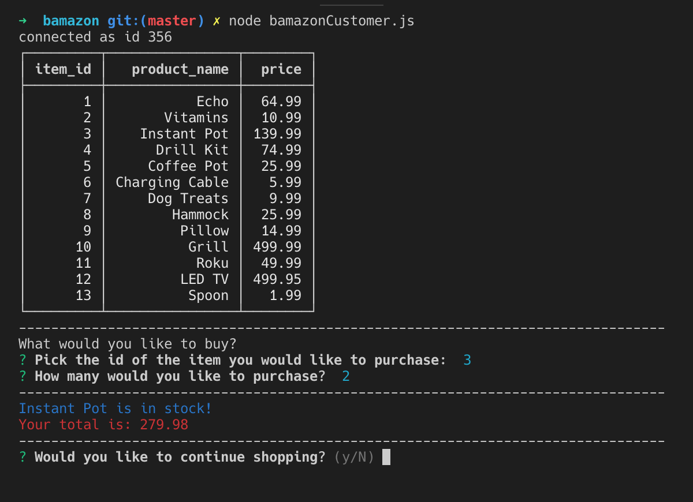
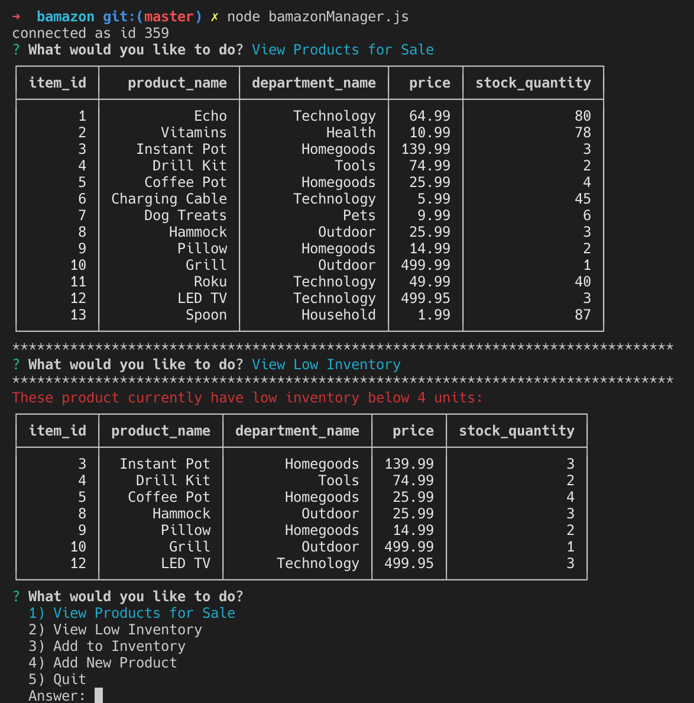
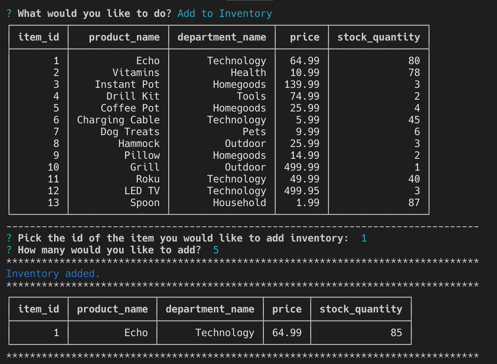
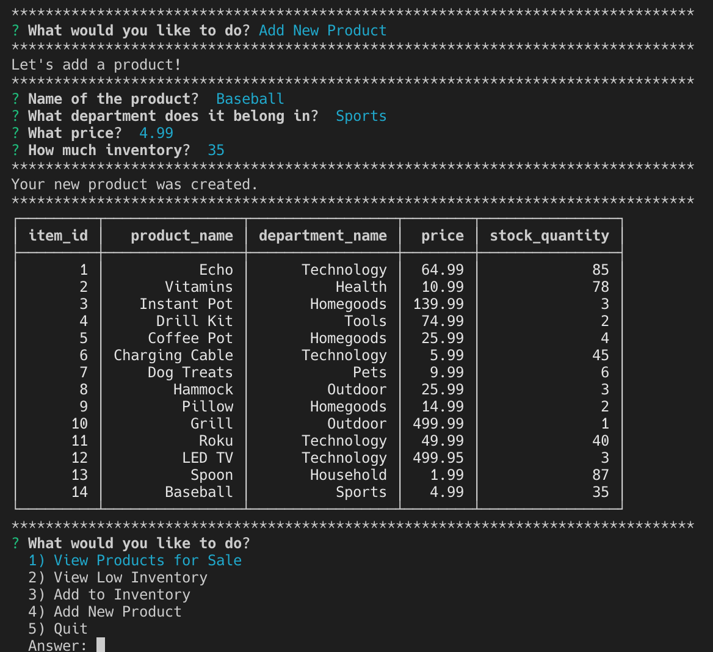

# bamazon
Node and MySQL app that runs a store front

## Purpose:
This is an Amazon like storefront using MySQL. This app will take in orders from customers and deplete stock from the store's inventory.  It will also show a Manager menu, allowing to check for low stock, add stock and add new products with unique ID numbers.

## Product Features

## How it works:
Launch the app with either: node bamazonCustomer.js or bamazonManager.js
Follow the Prompts and the updated tables will return the most current database.

## Functionality to add:
* Add supervisor view to track sales across departments

## Contributors:
I, Brad Hoffman, am the sole contributor to this site.